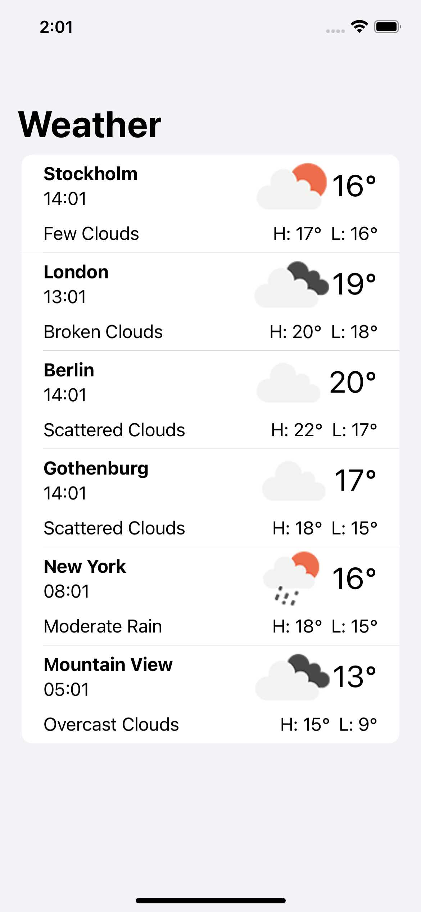
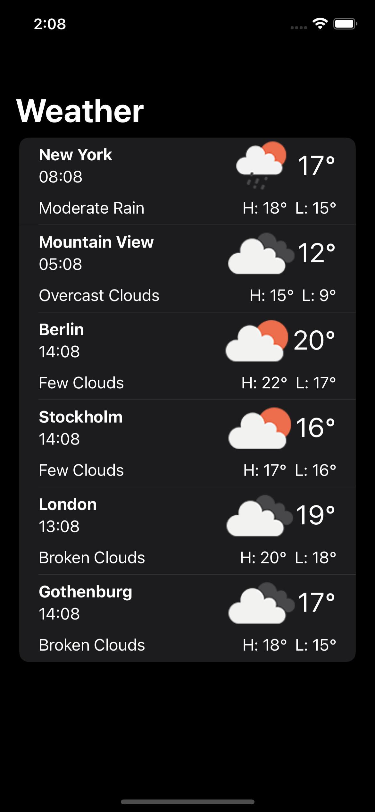

# Weather Application

## Table of Contents

- [Screenshots](#screenshots)
- [Description](#description)
- [Technologies Used](#technologies-used)
- [Getting Started](#getting-started)
- [Dependency Injection](#dependency-injection)
- [License](#license)

## Screenshots



## Description

The Weather Application is a simple iOS app using SwiftUI and Combine to display the current weather for specific cities using the OpenWeatherMap REST API. It follows SOLID principles to ensure clean code, maintainability, and testability.

It provides weather information for the following six cities: Gothenburg, Stockholm, Mountain View, London, New York, and Berlin.

The application allows users to view the current weather conditions, including temperature and weather icon.

User can perform a pull-down gesture to fetch the most recent weather conditions for each city.

## Technologies Used

- SwiftUI for the user interface.
- Combine for handling asynchronous data.
- OpenWeatherMap API for weather data.

## Getting Started

1. Clone the repository to your local machine.

```bash
git clone https://github.com/win-lhad/DuyWeatherApp.git
```

2. Build and run the application on a simulator or physical device.

- **The minimum deployment for this app is iOS 15.0**

## Dependency Injection

- `HomeService` depends on an implementation of `APIServiceProtocol` (usually `APIService`) to fetch weather data for specific cities.

- During testing, you can replace `APIService` with `MockAPIService` to simulate network responses and verify the behavior of your components without making actual network calls by fetching the data from JSON files

## License

This project is licensed under the MIT License - see the [LICENSE](LICENSE) file for details.
